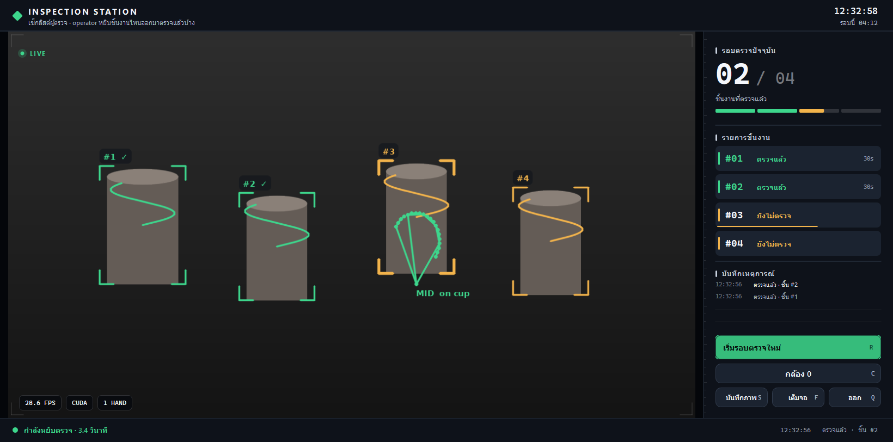
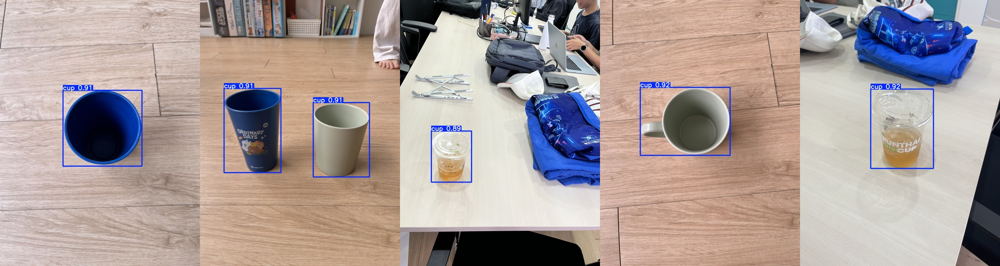

<h1 align="center">Cup&nbsp;Holding&nbsp;Detector</h1>

<p align="center">
  <em>A 90-minute “Computer Vision 101” workshop — one Colab notebook for the class,<br>
  one polished desktop app for the instructor.</em>
</p>

<p align="center">
  
  
  
  
  <a href="https://colab.research.google.com/github/P-PrPas/tkk_workshop/blob/main/notebooks/cv101.ipynb">
    </a>
</p>

<p align="center">
  
</p>

<p align="center"><sub>Rendered by <code>tools/ui_preview.py</code> with a synthetic scene —
no camera required. Re-shoot from the live app on the demo laptop before the event.</sub></p>

> **The whole point of this workshop:** making something that _sort of_ works is easy.
> Making it work _for real_ is hard. The notebook shows the easy 80%. The desktop app
> is the hard 20% — the engineering that sits _around_ a three-line rule.

---

## Table of contents

- [What this is](#what-this-is)
- [How it works — two models, one lesson](#how-it-works--two-models-one-lesson)
- [Repository layout](#repository-layout)
- [Quick start](#quick-start)
  - [A · Run the notebook (the class)](#a--run-the-notebook-the-class)
  - [B · Run the desktop app (the instructor)](#b--run-the-desktop-app-the-instructor)
- [Desktop app reference](#desktop-app-reference)
  - [Controls](#controls)
  - [`config.yaml`](#configyaml)
  - [Choosing a compute device (CUDA / MPS / CPU)](#choosing-a-compute-device-cuda--mps--cpu)
  - [Troubleshooting](#troubleshooting)
- [Development](#development)
- [Design docs](#design-docs)
- [License](#license)

---

## What this is

A self-contained teaching kit for a **90-minute** introductory CV session. Students
never install anything — they open one Google Colab notebook and press _Run all_.
The instructor closes the session by running a **native desktop app** that does the
same task as the notebook, but built to survive a live room.

| Audience | Deliverable | Runs on |
| --- | --- | --- |
| Students | [`notebooks/cv101.ipynb`](notebooks/cv101.ipynb) | Google Colab (free CPU) |
| Instructor | [`app/app.py`](app/app.py) | A laptop with a webcam |

The app is a Qt (PySide6) instrument panel: video on the left, a slot-meter checklist
and a round event log on the right, telemetry on the status strip.

The task in both: **track which items an operator has picked up and inspected**, live,
from a webcam. Every cup on the table gets an ID and a motion trail; a yellow box means
_not inspected yet_, a green box with a ✓ means _done_. One button starts a new round.

---

## How it works — two models, one lesson

Two object detectors, deliberately at opposite extremes. The _contrast_ is the content.

| | 🐣 Tiny model (notebook) | 🦾 Good model (app) |
| --- | --- | --- |
| Architecture | YOLO11n | YOLO11s |
| Training data | ~10 in-room photos + ~23 COCO cups | COCO 2017 `cup` — 9 204 train / 390 val |
| Epochs | 3 (~15 s on CPU) | 66 (~1–2 h on a V100) |
| Trained | live, in the session | ahead of time → [GitHub Release `v1`](https://github.com/P-PrPas/tkk_workshop/releases) |
| Result | finds cups in still photos, struggles live | COCO cup val **mAP50 = 0.707**; in-room cups 0.89–0.92 conf |

Both fine-tune from `yolo11n.pt` / `yolo11s.pt` — checkpoints that **already know
“cup”** (it is 1 of the 80 COCO classes). We keep that knowledge and nudge it. That
is what transfer learning actually looks like — not training from zero on 10 images.

<p align="center">
  
</p>

### The rule

Hand landmarks (MediaPipe, 21 points) + cup boxes (YOLO). If enough hand points fall
inside a cup box **and** the hand and the cup are roughly the same size on screen
(so a hand pointing from across the room doesn’t count) → the hand is on the cup.
Wrap that in a small state machine → `HOLDING`. Hold one cup long enough → that cup
is marked **inspected**, and stays marked even after it is put back down.

### What the app adds around the rule

The rule is identical to the notebook. Everything below is the “make it real” part:

| # | Addition | Problem it solves |
| --- | --- | --- |
| 1 | **Threaded capture + inference** | No latency build-up; boxes stay glued to the frame the model actually saw |
| 2 | **ByteTrack IDs + `CupMemory`** | A cup hidden by the gripping hand keeps its identity and position for ~1 s |
| 3 | **`HoldState` hysteresis** (3 up / 6 down) | The `HOLDING` label stops flickering at the boundary |
| 4 | **`Inspection` checklist** | A hand brushing past a cup no longer ticks it off — a leaky counter demands ~1 s of real holding. Ticks persist; `R` starts a new round |
| 5 | **Real error handling + camera picker** | Camera unplugged → reconnects itself; a `C` / **กล้อง** menu switches between the cameras found at startup; missing model/camera → a helpful message, not a traceback |
| 6 | **A real GUI** (PySide6 / Qt) | The checklist is a live list and needs a reset button — both are painful drawn onto a video frame. Qt also brings HiDPI scaling for the projector, antialiased custom painting, and system fonts, so the UI can speak Thai |

---

## Repository layout

```text
tkk_workshop/
├── notebooks/cv101.ipynb     # the class runs this on Colab
├── app/
│   ├── app.py                # the instructor runs this — the Qt window, display only
│   ├── vision.py             # Camera / Analyzer / rules / Inspection — no GUI in it
│   ├── overlay.py            # what gets drawn onto the frame — no torch in it
│   ├── config.yaml           # every value you might tune in the room
│   ├── requirements.txt      # pinned to match the notebook
│   └── test_vision.py        # logic self-check, no camera needed
├── tools/                    # build the big dataset, train the good model, profile, debug
├── docs/                     # design notes (00–04, Thai) — read 00 first
└── data/                     # git submodule → in-room images + labels + model mirror
```

---

## Quick start

### A · Run the notebook (the class)

**[▶ Open `cv101.ipynb` in Google Colab](https://colab.research.google.com/github/P-PrPas/tkk_workshop/blob/main/notebooks/cv101.ipynb)** → _Runtime ▸ Run all_.

No GPU needed. Grant the camera permission when the webcam cells ask (use Chrome —
Safari’s camera API is the least reliable). Nothing to edit, nothing to install.

### B · Run the desktop app (the instructor)

**Prerequisites**

- **Python 3.12** (3.11 and 3.13 also work; **not 3.14** — PyTorch / MediaPipe have no
  complete wheels for it yet). Check with `python --version`.
- A webcam.
- ~200 MB free for the model weights (downloaded automatically on first run).

**1. Clone**

```bash
git clone --recursive https://github.com/P-PrPas/tkk_workshop.git
cd tkk_workshop
```
`--recursive` pulls the `data/` submodule (in-room images + a mirror of the hand model).
If you forgot it: `git submodule update --init`.

**2. Create an isolated environment**

<table>
<tr><th>macOS / Linux</th><th>Windows (PowerShell / cmd)</th></tr>
<tr><td>

```bash
python3.12 -m venv .venv
source .venv/bin/activate
python -m pip install -U pip
```

</td><td>

```bat
py -3.12 -m venv .venv
.venv\Scripts\activate
python -m pip install -U pip
```

</td></tr>
</table>

Confirm the venv is active: `python -c "import sys; print(sys.executable)"` should
point inside `.venv`.

**3. Install dependencies**

```bash
pip install -r app/requirements.txt
```

<details>
<summary><strong>Optional: enable GPU acceleration</strong> (YOLO runs at ~5 FPS on CPU)</summary>

<br>

`torch` ships with `ultralytics`, but the CPU-only build. To use a GPU, reinstall the
right build for your machine, then the app picks it up automatically:

| Machine | Command | Note |
| --- | --- | --- |
| **NVIDIA** (Windows / Linux) | `pip install --force-reinstall torch torchvision --index-url https://download.pytorch.org/whl/cu124` | Pick a `cuXXX` no higher than the “CUDA Version” shown by `nvidia-smi`. |
| **Apple Silicon** (M1–M4) | `pip install torch torchvision` | The default PyPI wheel already includes the MPS backend. |
| **Intel Mac / no GPU** | `pip install onnxruntime` and set `model_path: models/best.onnx` in `config.yaml` | There is no GPU path; ONNX is the fastest CPU option. |

macOS has **no CUDA** — `--index-url .../cu124` has no macOS wheel. Use MPS or ONNX.

</details>

**4. Run**

```bash
python app/app.py
```

First launch downloads `best.pt` (from Release `v1`) and `hand_landmarker.task`.
The console prints the device it chose: `YOLO device: CUDA / MPS / CPU`.

**5. (optional) Check the logic**

```bash
python app/test_vision.py
```

---

## Desktop app reference

### Controls

Every button in the sidebar has a keyboard shortcut:

| Key | Action |
| --- | --- |
| `R` | Start a new inspection round — clears the checklist, trails and track IDs |
| `C` | Pick a camera — menu of the indices found at startup; the key alone cycles to the next |
| `S` | Save a still (`shot_<timestamp>.png`, camera view only) |
| `D` | Toggle debug overlay (hand points-in-box count) |
| `F` | Toggle fullscreen ↔ windowed |
| `Q` / `Esc` / close window | Quit |

The window is freely resizable — drag any edge; the video is letterboxed to fit.

### `config.yaml`

Every value that ever needs tuning at the venue lives here — **never edit `app.py`
during an event.**

| Key | Default | Meaning |
| --- | --- | --- |
| `model_path` | `models/best.pt` | `.pt` (GPU-friendly) · `.onnx` (CPU, auto-exported) · `yolo11m.pt` (fallback) |
| `cup_class` | `0` | `0` for the trained model · `41` for `yolo11m.pt` (COCO) |
| `device` | _(blank)_ | Blank = auto (`cuda → mps → cpu`). Force with `cuda` / `mps` / `cpu`. |
| `camera_index` | `0` | Starting camera — switch at runtime with the **กล้อง** button / `C`. Try `1` or `2` if it doesn’t open |
| `camera_probe` | `3` | Indices `0..N-1` probed at startup to populate the camera picker |
| `mirror` | `true` | Flip horizontally (selfie view) |
| `window_width` | `1280` | Initial window width |
| `camera_width` / `camera_height` | `1280` / `720` | Resolution requested from the camera — higher = crisper HUD on a projector |
| `imgsz` | `480` | Inference size. `384` faster, `640` slightly more accurate |
| `conf` | `0.25` | Lower (`0.15`) if cups are missed, raise if there are false hits |
| `cup_memory_frames` | `15` | How long a hidden cup keeps its last box |
| `grip_min_points` | `10` | Hand landmarks (of 21) that must fall inside the cup box |
| `grip_box_margin` | `0.35` | Cup box is expanded by this fraction before counting points |
| `grip_max_size_ratio` | `4.0` | Max hand/cup size ratio — rejects a hand pointing from far away |
| `hold_frames` / `release_frames` | `3` / `6` | Hysteresis: frames to latch `HOLDING` on / off (off > on = no flicker) |
| `pick_frames` | `8` | Frames of accumulated holding before a cup is ticked as inspected (a brush-past does not count) |
| `trail_length` | `60` | Points kept in each cup’s motion trail — `0` disables trails |
| `forget_seconds` | `4` | An *uninspected* cup gone this long drops off the checklist; inspected ones stay until reset |

### Choosing a compute device (CUDA / MPS / CPU)

Leave `device:` blank — the app resolves it in `pick_device()`: `cuda` if a CUDA GPU
is present, else `mps` on Apple Silicon, else `cpu`. The HUD (top-right) and the
startup log always show what is actually running.

> **“I installed torch but it still says CPU.”** Run
> `python -c "import torch; print(torch.__version__, torch.cuda.is_available())"`.
> A version ending in `+cpu` is the CPU-only build — reinstall using the table above.

### Troubleshooting

| Symptom | Fix |
| --- | --- |
| `module 'torch' has no attribute 'save'` | You’re on Python 3.14. Make the venv with **3.12**. |
| Exits with “เปิดกล้องไม่ได้” after 10 s | Another app is using the camera, or wrong index — try `camera_index: 1`. |
| `ModuleNotFoundError: PySide6` | `pip install -r app/requirements.txt` (it is `PySide6-Essentials`, not full `PySide6`). |
| Qt exits with `libGL.so.1: cannot open` (Linux) | `sudo apt install libgl1 libegl1` — Qt needs them; Windows and macOS do not. |
| A cup gets ticked when you only reach past it | Raise `pick_frames`. Ticked too slowly? Lower it. |
| Cups not detected | Lower `conf` to `0.15`; check lighting; try `imgsz: 640`. |
| `HOLDING` flickers | Increase `release_frames`. |
| ~5 FPS | Enable the GPU (see step 3) or switch to `best.onnx` + `onnxruntime`. |
| Model download fails | `gh release download v1 -R P-PrPas/tkk_workshop -p best.pt -D app/models` |

---

## Development

The good model is trained separately (it needs a real GPU). See
[`docs/03-models.md`](docs/03-models.md) for the full procedure.

```bash
python tools/build_bigdata.py          # assemble COCO cup + in-room images → datasets/cup_big/
bash   tools/train.sh                   # train YOLO11s (uses .venv-train, torch cu124)
python tools/eval.py runs/detect/cup_big/weights/best.pt   # mAP + visual sanity grid
```

Other tools: `tools/diag.py` (print every HOLDING signal per frame),
`tools/optimize.py` (benchmark ONNX / OpenVINO on the target CPU),
`tools/ui_preview.py` (render the whole window to `docs/app-ui.png` from a synthetic
scene — iterate on the UI on a machine with no camera and no CV stack installed).

---

## Design docs

Detailed design notes (in Thai) live in [`docs/`](docs/) — start with
[`00-overview.md`](docs/00-overview.md); the rest cross-reference from there.

| Doc | Topic |
| --- | --- |
| [`00-overview.md`](docs/00-overview.md) | Goals, the 90-minute budget, risk register, run-of-show |
| [`01-notebook-spec.md`](docs/01-notebook-spec.md) | The notebook, cell by cell |
| [`02-data.md`](docs/02-data.md) | Dataset, labels, the class-id gotcha |
| [`03-models.md`](docs/03-models.md) | Both training configs |
| [`04-desktop-app.md`](docs/04-desktop-app.md) | App architecture |

---

## License

Teaching material for a specific workshop — no formal open-source license yet.
Ask the repository owner before reusing.

<p align="center"><sub>Built with
<a href="https://docs.ultralytics.com/">Ultralytics YOLO11</a> ·
<a href="https://ai.google.dev/edge/mediapipe">MediaPipe Hand Landmarker</a> ·
OpenCV · Pillow · Qt for Python</sub></p>
